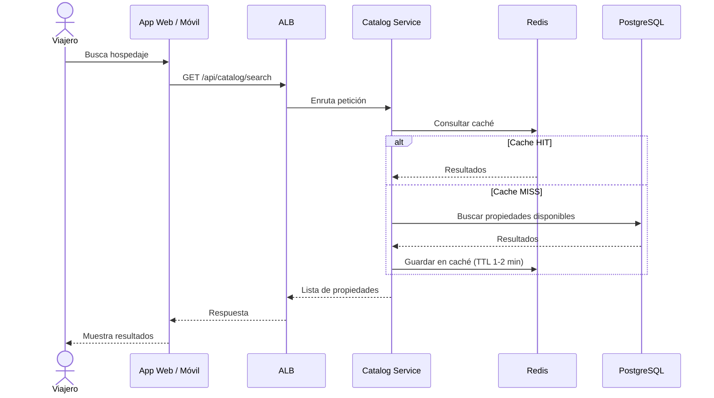

# Documentación Técnica — TravelHub

## Tabla de Contenidos

- [Documentación Técnica — TravelHub](#documentación-técnica--travelhub)
  - [Tabla de Contenidos](#tabla-de-contenidos)
  - [1. Visión de Arquitectura](#1-visión-de-arquitectura)
    - [1.1 Descripción General](#11-descripción-general)
    - [1.2 Atributos de Calidad](#12-atributos-de-calidad)
    - [1.3 Diagrama de Componentes](#13-diagrama-de-componentes)
    - [1.4 Diagrama de Despliegue (AWS)](#14-diagrama-de-despliegue-aws)
    - [1.5 Modelo de Dominio](#15-modelo-de-dominio)
    - [1.6 Comunicación entre Servicios](#16-comunicación-entre-servicios)
    - [1.7 Decisiones Arquitectónicas (ADRs)](#17-decisiones-arquitectónicas-adrs)
    - [1.8 Flujos Principales](#18-flujos-principales)
      - [1.8.1 Búsqueda de Hospedaje](#181-búsqueda-de-hospedaje)
      - [1.8.2 Creación de Reserva + Pago](#182-creación-de-reserva--pago)
      - [1.8.3 Confirmación / Rechazo por Hotel](#183-confirmación--rechazo-por-hotel)
      - [1.8.4 Cancelación + Reembolso](#184-cancelación--reembolso)
      - [1.8.5 Notificaciones](#185-notificaciones)
  - [2. Stack Tecnológico](#2-stack-tecnológico)
    - [2.1 Frontend Web](#21-frontend-web)
    - [2.2 Backend](#22-backend)
    - [2.3 Mobile](#23-mobile)
    - [2.4 Infraestructura Cloud (AWS)](#24-infraestructura-cloud-aws)
    - [2.5 Entorno de Desarrollo Local](#25-entorno-de-desarrollo-local)
  - [3. Estrategia de Pruebas](#3-estrategia-de-pruebas)
    - [3.1 Objetivos](#31-objetivos)
    - [3.2 TNT (Técnicas, Niveles y Tipos)](#32-tnt-técnicas-niveles-y-tipos)
    - [3.3 Herramientas de Testing](#33-herramientas-de-testing)
    - [3.4 Estándares y Quality Gates](#34-estándares-y-quality-gates)
    - [3.5 Distribución de Esfuerzo](#35-distribución-de-esfuerzo)
    - [3.6 Cronograma de Pruebas](#36-cronograma-de-pruebas)

---

## 1. Visión de Arquitectura

### 1.1 Descripción General

TravelHub es una plataforma de reservas de alojamiento basada en **5 microservicios** desplegados en **AWS ECS Fargate**, con comunicación síncrona (HTTP) para flujos críticos y asíncrona (EventBridge + SQS) para procesos desacoplados.

Los microservicios son:

| Servicio                   | Responsabilidad                                                                  |
| -------------------------- | -------------------------------------------------------------------------------- |
| **User & Auth**            | Autenticación, gestión de usuarios, RBAC                                         |
| **Catalog & Availability** | Búsqueda, filtros, inventario, tarifas                                           |
| **Booking**                | Creación y gestión de reservas, holds temporales, cancelaciones                  |
| **Payment**                | Integración con pasarelas de pago (Stripe, MercadoPago), Authorization & Capture |
| **Notification**           | Envío de emails (SES) y push notifications                                       |

### 1.2 Atributos de Calidad

Ordenados por prioridad en el diseño:

1. **Desempeño** — Búsqueda ≤800ms (p95), reserva ≤1.5s, pago ≤3s
2. **Seguridad** — RBAC, TLS 1.2+, tokenización PCI-DSS, subredes privadas
3. **Disponibilidad** — ≥99.95%, Multi-AZ, reinicio automático, DLQ
4. **Modificabilidad** — Nuevo proveedor de pago ≤40 hh, despliegue independiente por servicio

### 1.3 Diagrama de Componentes


**Comunicación entre servicios:**

| Tipo              | Mecanismo                      | Uso                                                                      |
| ----------------- | ------------------------------ | ------------------------------------------------------------------------ |
| Sincrónica        | HTTP interno (ALB + Cloud Map) | Cliente → Servicio y Booking → Catalog (validar/hold/release inventario) |
| Asíncrona         | EventBridge → SQS              | Servicio → Servicio (pagos, notificaciones, cambios de estado)           |
| Service Discovery | AWS Cloud Map (DNS)            | Resolución interna (`booking.services.local`)                            |

### 1.4 Diagrama de Despliegue (AWS)


| Aspecto             | Decisión                                                 |
| ------------------- | -------------------------------------------------------- |
| Alta disponibilidad | Multi-AZ en ECS y RDS                                    |
| Red                 | Microservicios en subredes privadas; solo ALB es público |
| TLS                 | Terminación en ALB con ACM                               |
| Secretos            | AWS Secrets Manager                                      |

### 1.5 Modelo de Dominio


[Ver diagrama interactivo](https://dbdiagram.io/d/PF_Dominio_Refinado-699b6ef4bd82f5fce271851d)

La base de datos es una única instancia RDS PostgreSQL Multi-AZ con aislamiento lógico por esquemas:

| Esquema         | Servicio               | Entidades principales                                                                              |
| --------------- | ---------------------- | -------------------------------------------------------------------------------------------------- |
| `users`         | User & Auth            | User, Hotel, HotelUser, Agency, AgencyUser                                                         |
| `catalog`       | Catalog & Availability | Property, RoomType, Amenity, RatePlan, RateCalendar, InventoryCalendar, CancellationPolicy, Review |
| `booking`       | Booking                | Booking, BookingStatusHistory                                                                      |
| `payments`      | Payment                | Payment, Refund                                                                                    |
| `notifications` | Notification           | Notification                                                                                       |

Cada servicio accede exclusivamente a su propio esquema. Las referencias cruzadas se manejan mediante IDs, sin JOINs entre esquemas.

### 1.6 Comunicación entre Servicios

**Eventos principales:**

| Evento                    | Productor | Consumidor(es)        |
| ------------------------- | --------- | --------------------- |
| `PaymentRequested`        | Booking   | Payment               |
| `PaymentAuthorized`       | Payment   | Booking               |
| `PaymentCaptureRequested` | Booking   | Payment               |
| `PaymentCancelRequested`  | Booking   | Payment               |
| `PaymentSucceeded`        | Payment   | Booking, Notification |
| `PaymentFailed`           | Payment   | Booking, Notification |
| `BookingConfirmed`        | Booking   | Notification          |
| `BookingCancelled`        | Booking   | Notification          |

### 1.7 Decisiones Arquitectónicas (ADRs)

| ID      | Decisión                                         | Justificación                                                                               |
| ------- | ------------------------------------------------ | ------------------------------------------------------------------------------------------- |
| ADR-001 | Microservicios sobre AWS ECS Fargate             | Escalado independiente por servicio, aislamiento de fallos, rolling updates sin downtime    |
| ADR-002 | Comunicación asíncrona con EventBridge + SQS     | Desacopla Booking ↔ Payment ↔ Notification; SLAs independientes sin bloqueo entre servicios |
| ADR-003 | Authorization & Capture en dos fases para pagos  | El usuario no es cobrado si el hotel rechaza; soportado por Stripe y MercadoPago            |
| ADR-004 | BD compartida con aislamiento por esquemas (MVP) | Simplifica operación; preparado para separación futura sin cambios en código                |
| ADR-005 | Caché distribuido con Redis (ElastiCache)        | Reduce latencia de búsqueda y tráfico de lectura a RDS en ~60-70%                           |

### 1.8 Flujos Principales

#### 1.8.1 Búsqueda de Hospedaje

**SLA:** ≤ 800ms (p95)



#### 1.8.2 Creación de Reserva + Pago

**SLAs:** Reserva ≤ 1.5s (p95), Pago ≤ 3s (p95)

El flujo opera como una **Saga por coreografía** en dos etapas:

**Etapa A — Checkout Start:** El viajero selecciona habitaciones → Booking solicita `createHold(15 min)` a Catalog → si hay disponibilidad, se crea la reserva en estado `CART`.

**Etapa B — Checkout Confirm:** El viajero confirma pago → Booking cambia estado a `PENDING_PAYMENT` y publica `PaymentRequested` → Payment autoriza sin cobro → si OK, estado pasa a `PENDING_CONFIRMATION` y se notifica al hotel.

```
CART → PENDING_PAYMENT → PENDING_CONFIRMATION → CONFIRMED / CANCELLED
```

#### 1.8.3 Confirmación / Rechazo por Hotel

- **Confirmación:** Hotel confirma → `PaymentCaptureRequested` → Payment captura pago → `CONFIRMED` + `confirmHold` en Catalog
- **Rechazo:** Hotel rechaza → `releaseHold` + `PaymentCancelRequested` → `REJECTED` (sin cobro al viajero)
- **Timeout (24h):** Auto-confirm o auto-cancel según política del hotel

#### 1.8.4 Cancelación + Reembolso

El viajero cancela una reserva confirmada. El reembolso depende de la política de cancelación:

| Política         | Comportamiento                                   |
| ---------------- | ------------------------------------------------ |
| `non_refundable` | Sin reembolso                                    |
| `partial`        | Reembolso parcial según días previos al check-in |
| `full`           | Reembolso completo                               |

Booking libera inventario en Catalog, marca la reserva como `CANCELLED`, y si corresponde, publica `RefundRequested` para que Payment procese el reembolso.

#### 1.8.5 Notificaciones

El Notification Service consume eventos de dominio desde su cola SQS y envía emails (SES) y push notifications. Soporta **Competing Consumers**: múltiples instancias procesan mensajes en paralelo. Mensajes que fallan N veces se envían a Dead Letter Queue.

| Evento              | Destinatario    | Canal        |
| ------------------- | --------------- | ------------ |
| `BookingConfirmed`  | Viajero + Hotel | Email + Push |
| `BookingCancelled`  | Viajero + Hotel | Email + Push |
| `PaymentSucceeded`  | Viajero         | Email        |
| `PaymentFailed`     | Viajero         | Email + Push |
| `PaymentAuthorized` | Hotel           | Email        |

---

## 2. Stack Tecnológico

### 2.1 Frontend Web

| Tecnología                   | Propósito                                              |
| ---------------------------- | ------------------------------------------------------ |
| React 18                     | Librería UI (portal viajeros, portal hoteles/agencias) |
| TypeScript                   | Tipado estático                                        |
| Vite                         | Build tool y dev server                                |
| React Router v6              | Navegación client-side                                 |
| Axios                        | Cliente HTTP                                           |
| TailwindCSS                  | Framework CSS utilitario                               |
| React Query (TanStack Query) | Estado del servidor, caché y sincronización            |
| React Hook Form + Zod        | Formularios y validación de schemas                    |
| ESLint + Prettier            | Linting y formateo                                     |
| Vitest                       | Testing unitario                                       |

### 2.2 Backend

| Tecnología              | Propósito                                               |
| ----------------------- | ------------------------------------------------------- |
| Python 3.11+            | Lenguaje de los microservicios                          |
| FastAPI                 | Framework web async para APIs REST                      |
| Uvicorn                 | Servidor ASGI                                           |
| Pydantic v2             | Validación de datos y contratos                         |
| SQLAlchemy 2.0          | ORM async para PostgreSQL                               |
| Alembic                 | Migraciones de base de datos                            |
| HTTPX                   | Cliente HTTP async entre servicios                      |
| Boto3                   | SDK de AWS (SQS, EventBridge, SES, S3, Secrets Manager) |
| Redis (redis-py)        | Cliente para caché distribuido                          |
| Pytest + pytest-asyncio | Testing (cobertura >= 70%)                              |

### 2.3 Mobile

| Tecnología                          | Propósito                                |
| ----------------------------------- | ---------------------------------------- |
| React Native + Expo                 | Framework cross-platform (iOS y Android) |
| TypeScript                          | Tipado estático                          |
| Expo Router                         | Navegación basada en archivos            |
| Axios                               | Cliente HTTP                             |
| Expo Notifications                  | Push notifications                       |
| AsyncStorage                        | Persistencia local                       |
| expo-sqlite                         | Caché offline de búsquedas               |
| Jest + React Native Testing Library | Testing                                  |

### 2.4 Infraestructura Cloud (AWS)

| Servicio                   | Propósito                                          |
| -------------------------- | -------------------------------------------------- |
| Amazon ECS (Fargate)       | Orquestación de contenedores, Multi-AZ             |
| Amazon ECR                 | Registro de imágenes Docker                        |
| Amazon RDS (PostgreSQL)    | BD relacional Multi-AZ                             |
| Amazon ElastiCache (Redis) | Caché distribuido                                  |
| Amazon EventBridge         | Bus de eventos entre microservicios                |
| Amazon SQS                 | Colas de mensajes (Payment, Booking, Notification) |
| Amazon VPC                 | Red privada Multi-AZ                               |
| Application Load Balancer  | Punto de entrada, enrutamiento, TLS termination    |
| AWS Cloud Map              | Service Discovery interno                          |
| Amazon S3                  | Assets estáticos del frontend                      |
| Amazon CloudFront          | CDN para distribución del frontend                 |
| AWS Secrets Manager        | Credenciales y API keys                            |
| Amazon CloudWatch          | Logs, métricas y alarmas                           |
| Amazon SES                 | Emails transaccionales                             |
| GitHub Actions             | CI/CD (build, test, deploy)                        |

### 2.5 Entorno de Desarrollo Local

| Componente    | Herramienta         |
| ------------- | ------------------- |
| Base de datos | PostgreSQL (Docker) |
| Caché         | Redis (Docker)      |
| Mensajería    | RabbitMQ (Docker)   |
| Orquestación  | Docker Compose      |
| Frontend      | Vite dev server     |
| Secretos      | .env files          |
| Email         | Mock                |

---

## 3. Estrategia de Pruebas

### 3.1 Objetivos

| ID      | Objetivo                                                                                                                            | Enfoque                |
| ------- | ----------------------------------------------------------------------------------------------------------------------------------- | ---------------------- |
| OBJ-001 | Pruebas exploratorias manuales sobre flujos MVP (búsqueda, reserva, pago, cancelación, portal hotel, móvil) con checklist por flujo | Funcional, caja negra  |
| OBJ-002 | Cobertura mínima automatizada ≥70% por capa (Backend, Web, Mobile)                                                                  | Funcional, caja blanca |
| OBJ-003 | Quality Gate en CI/CD: unitarias + smoke API + cobertura en cada PR. Merge bloqueado si falla prueba o cobertura < 70%              | Automatizado           |
| OBJ-004 | 10-12 pruebas de integración/API representativas entre servicios (escenarios positivos y negativos)                                 | Funcional, caja negra  |
| OBJ-005 | E2E mínimo de flujos críticos: 2 flujos web (Playwright) + 1 flujo móvil (Detox)                                                    | Funcional, caja negra  |
| OBJ-006 | Verificación no funcional mínima: performance baseline, seguridad básica, i18n, a11y                                                | No funcional           |

### 3.2 TNT (Técnicas, Niveles y Tipos)

| Nivel              | Tipo                            | Técnica                                                               | Objetivo |
| ------------------ | ------------------------------- | --------------------------------------------------------------------- | -------- |
| Sistema            | Funcional + Usabilidad (manual) | Pruebas exploratorias guiadas + checklist de flujos MVP               | OBJ-001  |
| Unidad             | Funcional, caja blanca          | Unitarias por API (Pytest / Jest / RN TL) + cobertura ≥70%            | OBJ-002  |
| Integración        | Funcional, caja negra           | Integración/API (10-12 pruebas representativas) + contratos básicos   | OBJ-004  |
| Sistema            | Funcional, caja negra           | E2E Web (Playwright) — 2 flujos críticos                              | OBJ-005  |
| Sistema            | Funcional, caja negra           | E2E Móvil (Detox) — 1 flujo crítico                                   | OBJ-005  |
| Sistema            | No funcional (Rendimiento)      | Baseline performance (búsqueda/reserva) vs metas del enunciado        | OBJ-006  |
| Sistema            | No funcional (Seguridad)        | Checklist: TLS, tokenización, no almacenar tarjeta, auth/sesión/roles | OBJ-006  |
| Sistema/Aceptación | No funcional (i18n)             | Smoke: moneda/fechas/zonas horarias en flujos MVP                     | OBJ-006  |
| Sistema/Aceptación | No funcional (a11y)             | Web: axe/Lighthouse a11y + checklist (contraste, labels, focus)       | OBJ-006  |

### 3.3 Herramientas de Testing

| Capa             | Herramienta                          | Tipo de prueba                    |
| ---------------- | ------------------------------------ | --------------------------------- |
| Backend (Python) | Pytest + pytest-asyncio + pytest-cov | Unitarias, integración, cobertura |
| Frontend Web     | Vitest + React Testing Library       | Unitarias de componentes          |
| Frontend Web     | Playwright                           | E2E web                           |
| Mobile           | Jest + React Native Testing Library  | Unitarias móvil                   |
| Mobile           | Detox                                | E2E móvil                         |
| Performance      | Herramientas de medición de tiempos  | Baseline vs SLAs                  |
| Accesibilidad    | axe / Lighthouse                     | Auditoría a11y web                |
| CI/CD            | GitHub Actions                       | Ejecución automatizada en cada PR |

### 3.4 Estándares y Quality Gates

- **Cobertura mínima:** ≥70% en cada capa (Backend, Web, Mobile)
- **Gating en CI/CD:** el merge se bloquea si:
  - Falla alguna prueba unitaria o smoke de API
  - La cobertura de cualquier capa queda por debajo de 70%
- **Herramientas de cobertura:**
  - Backend: `pytest-cov`
  - Web: `jest --coverage`
  - Mobile: `jest --coverage` / RN Testing Library
- **Evidencia:** el pipeline genera reportes de logs/resultados consultables por PR

### 3.5 Distribución de Esfuerzo

La distribución sigue la pirámide de automatización: mayor esfuerzo en unitarias e integración, E2E solo para flujos críticos, y pruebas manuales para exploración y usabilidad.

| Actividad                                            | Enfoque                    | % Esfuerzo |
| ---------------------------------------------------- | -------------------------- | ---------- |
| Pruebas exploratorias (flujos MVP)                   | Manual / sistema           | 10%        |
| Pruebas unitarias (Pytest/Jest/RN TL) + cobertura    | Automatizada / unidad      | 35%        |
| Pruebas de integración y API (contratos + endpoints) | Automatizada / integración | 30%        |
| Pruebas E2E (Playwright/Detox) — mínimo              | Automatizada / sistema     | 15%        |
| No funcional (performance, seguridad, i18n, a11y)    | Mixta / sistema-aceptación | 10%        |

### 3.6 Cronograma de Pruebas

| Semana | Actividad                                                                                     | Objetivo |
| ------ | --------------------------------------------------------------------------------------------- | -------- |
| 1      | Exploratorias + checklist de flujos MVP + datos de prueba + smoke manual por canal            | OBJ-001  |
| 2      | Unitarias base (Back/Web/Mobile) + configuración de cobertura y reporte                       | OBJ-002  |
| 3      | Integración/API mínima (10-12 pruebas) + contratos básicos                                    | OBJ-004  |
| 4      | CI/CD: quality gate (unitarias + smoke API + cobertura <70% bloquea)                          | OBJ-003  |
| 5      | E2E Web (2 flujos) + estabilización (esperas, datos, ambiente)                                | OBJ-005  |
| 6      | E2E Móvil (1 flujo) + cierre de defectos críticos                                             | OBJ-005  |
| 7      | No funcional mínimo: performance baseline + seguridad básica + i18n + a11y + aceptación final | OBJ-006  |
